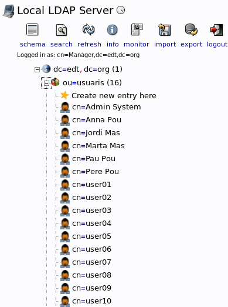

# tunelssh

Repositori per tunels ssh de l'assignatura M11 d' ASIX

# Índex

- [Exercici 15 ldap remot i phpldapadmin local](#15.-ldap-remot-i-phpldapadmin-local)
  
  - [Enunciat exercici](#Enunciat)
  
  - [Passos per a desplegar el ldap remot](#Passos-per-a-desplegar-el-ldap-remot)
    
    - [Túnel host local i ldap remot](#Túnel-host-local-i-ldap-remot)

# Exercicis

# 15. ldap remot i phpldapadmin local

### Enunciat

Desplegem dins d’un container Docker (host-remot) en una AMI (host-destí) el servei ldap amb el firewall de la AMI només obrint el port 22. Localment al host de l’aula (host-local) desplegem un container amb phpldapadmin. Aquest container ha de poder accedir a les dades ldap. des del host de l’aula volem poder visualitzar el phpldapadmin.

### Passos per a desplegar el ldap remot

Accedim a la màquina AMI.

```bash
[marc@localhost kerberos19]$ ssh -i swarm19_1.pem fedora@54.158.136.77
```

Arrenquem el servidor ldap amb dades

```bash
[fedora@ip-172-31-35-196 ~]$ sudo docker run --rm --name ldap.edt.org -h ldap.edt.org -d marcgc/ldapserver19 initdbedt
```

Comprovem que sol tenim obert el port del ssh a l'AMI

```bash
PORT   STATE SERVICE
22/tcp open  ssh
```

Arreglem la resolució de noms pel contàiner

```bash
[fedora@ip-172-31-35-196 ~]$ sudo vi /etc/hosts
127.0.0.1   localhost localhost.localdomain localhost4 localhost4.localdomain4
::1         localhost localhost.localdomain localhost6 localhost6.localdomain6

172.17.0.2 ldap.edt.org
```

#### Túnel host local i ldap remot

Obrim el túnel per accedir des del host-local

```bash
[marc@localhost kerberos19]$ ssh -i swarm19_1.pem -L 50000:ldap.edt.org:389 fedora@54.158.136.77
```

Comprovem que podem veure les dades preguntant a localhost al port del túnel

```bash
[marc@localhost kerberos19]$ ldapsearch -x -LLL -h localhost -p 5000 -b 'dc=edt,dc=org' dn
dn: dc=edt,dc=org
dn: ou=usuaris,dc=edt,dc=org
dn: cn=Pau Pou,ou=usuaris,dc=edt,dc=org
dn: cn=Pere Pou,ou=usuaris,dc=edt,dc=org
dn: cn=Anna Pou,ou=usuaris,dc=edt,dc=org
dn: cn=Marta Mas,ou=usuaris,dc=edt,dc=org
dn: cn=Jordi Mas,ou=usuaris,dc=edt,dc=org
dn: cn=Admin System,ou=usuaris,dc=edt,dc=org
dn: cn=user01,ou=usuaris,dc=edt,dc=org
dn: cn=user02,ou=usuaris,dc=edt,dc=org
dn: cn=user03,ou=usuaris,dc=edt,dc=org
dn: cn=user04,ou=usuaris,dc=edt,dc=org
dn: cn=user05,ou=usuaris,dc=edt,dc=org
dn: cn=user06,ou=usuaris,dc=edt,dc=org
dn: cn=user07,ou=usuaris,dc=edt,dc=org
dn: cn=user08,ou=usuaris,dc=edt,dc=org
dn: cn=user09,ou=usuaris,dc=edt,dc=org
dn: cn=user10,ou=usuaris,dc=edt,dc=org
```

### Passos per desplegar el servei phpldapadmin local

#### Túnel entre php local i ldap remot

Primer obrirem el túnel des de l'interfície ldapnet (local) amb el servidor ldap remot, rebotant al host-destí

```bash
[marc@localhost kerberos19]$ ssh -i swarm19_1.pem -L 172.18.0.1:50000:ldap.edt.org:389 fedora@54.158.136.77
```

Editem la configuració (`config.php`) per a que vagi pel túnel que hem creat i arrenquem el servei

```bash
$servers->setValue('server','host','172.18.0.1');
$servers->setValue('server','port',50000);
```

### Resultats

Accedim a la base de dades amb el phpldapadmin des del navegador del host local


Comprovem que podem veure els users del server ldap remot



## 16. ldap local i phpldapadmin remot

Obrir localment un ldap al host. Engegar al AWS un container phpldapadmin que usa el ldap del host de l’aula. Visualitzar localment al host de l’aula el phpldapadmin del container de AWS EC2. Ahí ez nà.

### Passos per desplegar el ldap local

Despleguem el servidor ldap local

```bash
[root@localhost ~]# docker run --rm --name ldap.edt.org -h ldap.edt.org --net ldapnet -d marcgc/ldapserver19 initdbedt
007ae31e5786527de9f826c267cf6c3101203610c9ae7e7eb74cca19eb5ec54a
```

Comprovem que des del host local podem accedir a les dades del servidor ldap del contàiner

```bash
[root@localhost ~]# ldapsearch -x -LLL -h 172.18.0.2 -b 'dc=edt,dc=org' dn 
dn: dc=edt,dc=org
dn: ou=usuaris,dc=edt,dc=org
dn: cn=Pau Pou,ou=usuaris,dc=edt,dc=org
dn: cn=Pere Pou,ou=usuaris,dc=edt,dc=org
dn: cn=Anna Pou,ou=usuaris,dc=edt,dc=org
...
```

### Passos previs al desplegament php remot

Abans d'engegar el servidor php, ens hem d'assegurar que el servidor sshd de l'AMI permet el bind a diferents interfícies als túnels, ja que per defecte sol permet localhost. Ho editem a `/etc/ssh/sshd_config` i fem un restart del servei sshd (si no ho fem no s'aplicaràn els canvis i el bind només el farà a localhost)

```bash
...
GatewayPorts yes
...
```

### Passos per desplegar el php remot

Arrenquem el contàiner de forma interactiva per a poder tocar la configuració

```bash
[fedora@ip-172-31-35-196 ~]$ sudo docker run --rm --name php -h php --net ldapnet -it marcgc/ldapserver19:phpldapadmin /bin/bash
```

* Necessitarem el gateway de la xarxa ldapnet, aixi que l'apuntem, en aquest cas és `172.19.0.1`.

Editem la configuració del php

```bash
$servers->setValue('server','host','172.19.0.1');
# Aquí indiquem el port 50000 tot i que encara no hem fet el túnel
$servers->setValue('server','port',50000);
```

#### Túnel entre ldap local i php remot

Ara ve lo divertit, farem un túnel des del ldap local al php remot amb la següent ordre:

```bash
# L'ordre l'executarem des del host local que rebotarà al docker, el host destí farà el mateix amb el php remot
[marc@localhost kerberos19]$ ssh -i swarm19_1.pem -R 172.19.0.1:50000:172.18.0.2:389 fedora@18.209.174.13
```

* `172.19.0.1:50000`  és el servidor php remot

* `172.18.0.2:389` és el servidor ldap local

* `fedora@18.209.174.13` és el host destí

Editem el /etc/hosts del host destí per la resolució del php

```bash
172.19.0.2 ldapadmin
```

#### Túnel entre host local i php remot per visualitzar-lo

Per finalitzar, crearem un túnel directe des del host local al host destí, rebotant al php per a poguer accedir des del nostre navegador

```bash
[marc@localhost kerberos19]$ ssh -i swarm19_1.pem -L 8080:ldapadmin:80 fedora@18.209.174.13
```

### Resultats

* Les imatges són les matèixes que hem fet servir en la pràctica anterior perquè el resultat és el mateix si ho hem fet tot bé, encara que tinguem el php remot

Accedim a la base de dades amb el phpldapadmin des del navegador del host local


Comprovem que podem veure els users del server ldap remot


