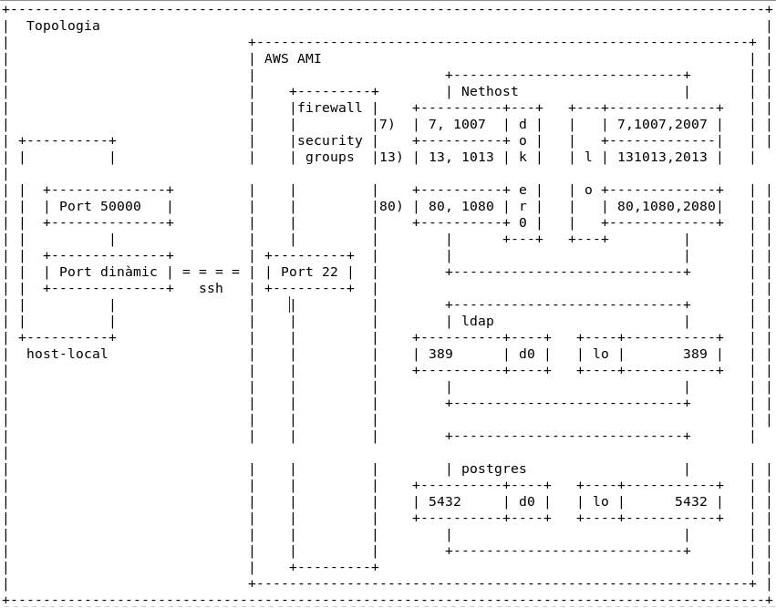

# Tunels SSH

## Explicació i objectiu

Un túnel ssh directe és aprofitar una connexió SSH segura per obrir un port en el **host local** que connecta amb un port d'un servei en un **host remot**, servei al que no es tindria accés directament.

És a dir, tindrem un port al host local (host de casa, per exemple) que connecta **directament** amb el port d'un servei remot (AMI d'Amazon sense mapejar) al qual no podriem accedir directament ja que es troba en una xarxa privada.

## Topologia



### Elements de la topologia

* `host-local`: host des del qual **establim** el túnel ssh. Per exemple, l'ordinador de casa o de classe.

* `host-destí`: host al que ens **connectem**. Necessitem un *user@desti* i que tingui el servei sshd engegat. Per exemple, la màquina AMI que hem obert a Amazon (assegurar que accepta connexions SSH)

* `host-remot`: qualsevol host que es troba en una **xarxa local privada** del **host-destí**. Des del **host-local** és impossible accedir-hi directament, hem de passar pel destí. Per exemple, el servei que tenim en un contàiner a la màquina AMI d'Amazon sense mapejar.

## Tipus de túnels i ordre

Hi han diferents tipus de túnels:

* `Túnel directe a host-destí`: és el tipus més usual i consisteix en accedir, des del *host-local*, a un **servei** d'un *host-destí* que no està publicat de cara a l'exterior.
  
  En aquest model obrim una porta local (al *host-local*) que permet accedir al port del **servei** del *host-destí*. Aquest és un port al que no podriem accedir directamente perquè no és públic.
  
  El túnel **s'estableix entre** *host-local* i *host-destí*, sent en el destí que **rebota** al **localhost al port del servei** al que es vol accedir.
  
  Els exemples més típics són per accedir a serveis del *host-destí* que no permeten connexions segures (un postgres, http-80, ldap-389...) i que no es publiquen a l'exterior per evitar-ne l'accés, només són accessibles des del propi *host-destí*.
  
  En aquest cas el **rebot** és al **propi host-destí**, indicat com a **localhost**.
  
  ```bash
  # Format de l'ordre túnel directe
  ssh -L [interfície-local]:port-local:host-desti:port-destí user@hostdestí
  # Connectem amb el port local 5000 al port 13 del host destí
  ssh -L 5000:localhost:13 user@hostdesti
  ```

* `Túnel directe a host-destí per accedir a host-remot-destí`: en aquest model volem accedir, des del *host-local*, a un servei que està en un *host-remot* al qual **no es té accés**.
  
  Per a conseguir aquesta connexió cal fer un túnel ssh del *host-local* al *host-destí* indicant el **rebot** al *host-remot*.
  
  Per exemple, fem un túnel ssh entre el *host-local* (aula-casa) i el *host-destí* (AMI d'Amazon) **rebotant** al container Docker anomenat *ldap.edt.org al port 389*. Aquest container està en una xarxa privada de docker i no es podria accedir des de l'exterior sense el túnel.
  
  ```bash
  # Format de l'ordre túnel directe amb rebot
  ssh -L [interfície-local]:port-local:host-remot:port-remot user@hostdestí
  # Connectem amb el port local 5000 amb el port 389 del host remot tot i que connectem al host destí
  ssh -L 5000:ldap.edt.org:389 user@hostdestí
  ```

* `Túnel reverse al host-destí`: és el mateix que el **túnel directe** però amb la diferència que la porta que deixem oberta és la del *host-destí* que està connectada amb el *host-local*. D'aquesta forma i des del *host-destí*, fent ssh al port especificat del *host-destí*, estarem connectant amb el *host-local*.
  
  El **túnel reverse** sempre obre una porta en el *host-destí*.
  
  ```bash
  # Format de l'ordre túnel reverse
  ssh -R [interfície-destí]:port-destí:host-local:port-local user@hostdestí
  # Connectem amb el port destí 5000 amb el port 13 del host local
  ssh -R 5000:localhost:13 user@hostdestí
  ```

* `Túnel reverse al host-remot-origen`: en aquest model, com en el cas anterior, el que fem és deixar una porta oberta al *host-destí* per accedir a la **xarxa local rebotant** a través del *host-local*.
  
  ```bash
  # Format de l'ordre túnel reverse amb rebot
  ssh -R [interfície-destí]:port-destí:host-remot-local:port-remot 
  # Connectem amb el port destí 5000 amb el port 389 del host remot local ldap.edt.org
  ssh -R 5000:ldap.edt.org:389 user@hostdestí
  ```
